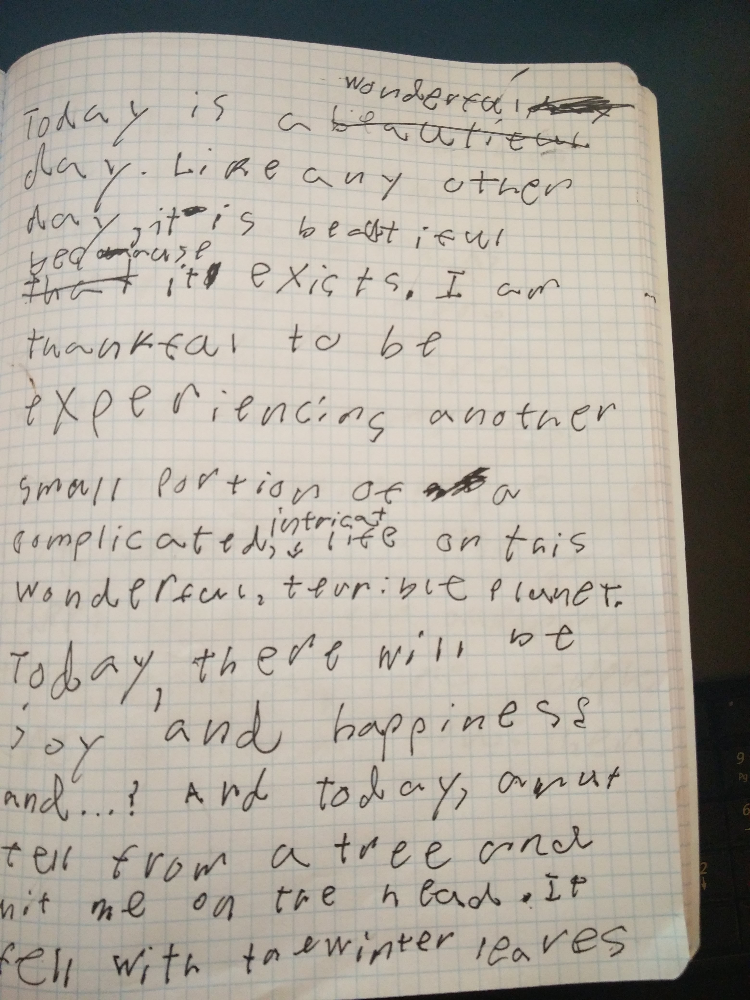

I wish that I could say that this portfolio was cohesive, coherent, and calculated. It is not for the very reason that it is a survey of my thoughts and ideas, which are by definition none of those things . The commonalities that have emerged between these pieces say much more about the way my mind works than about my abilities in planning. This is a study in cognition.

I decided after midterms not to start any new essays. In that way, “On This Wonderful Terrible Day” was a happy accident, inspired by a scene and a song two weeks ago. The concept caught me sitting on the green, listening to the Against Me song “Turn Those Clapping Hands Into Angry Balled Fists.” and looked up to see a split in the trees. Half having lost nearly all of their leaves, while the other half still carried their fall colors. Having nothing resembling a clear vision of what the essay should become, but a strange urge to put into words my immediate thoughts, I pulled my math notebook from my bag, having forgotten my others and began to write in pen. I penned two pages in a massive, rushed, sloppy handwriting that I would later struggle to interpret to type.

To me, writing that particular essay was the pinnacle of my course experience. I applied almost all of the techniques that we learned in a very short time, pushed by my own desire to finish the pursuit of an organic inspiration.
